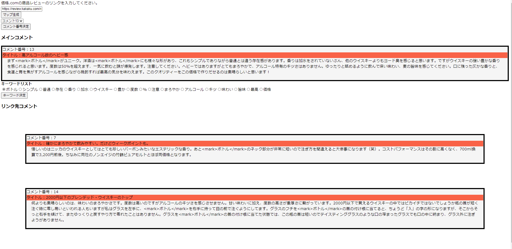

<h1>CommentMap_ReactFlask</h1>
<a href="https://github.com/uchida0/CommentMap">CommentMap</a>を今後扱いやすくするために、ReactとTypeScriptで再構成しメンテナンス性を上げた。 
 

<h2>概要</h2>

<a href="https://github.com/uchida0/CommentMap">CommentMap</a>と機能的なところでは大きくは変わっていない。 
Flaskだけで構成されていた物をFlaskをAPIとして用いる運用に変更している。

<h2>サンプル</h2>

<a href="https://review.kakaku.com/review/K0000695816/#tab">フロムザバレル(ウィスキー)のサンプル画像</a>

  

<h2>使用技術など</h2>

<h3>バックエンド</h3>
<ul>
    <li>Python3
    <li>Flask
    <li>BeautifulSoup
    <li>MeCab
    <li>MongoDB
</ul>

<h3>フロントエンド</h3>
<ul>
    <li>React Hooks
    <li>TypeScript
    <li>HTML
    <li>CSS
    <li>D3.js（リンク付きマップの描画とするため実装予定）
    <li><s>LeaderLine.js</s>
</ul>